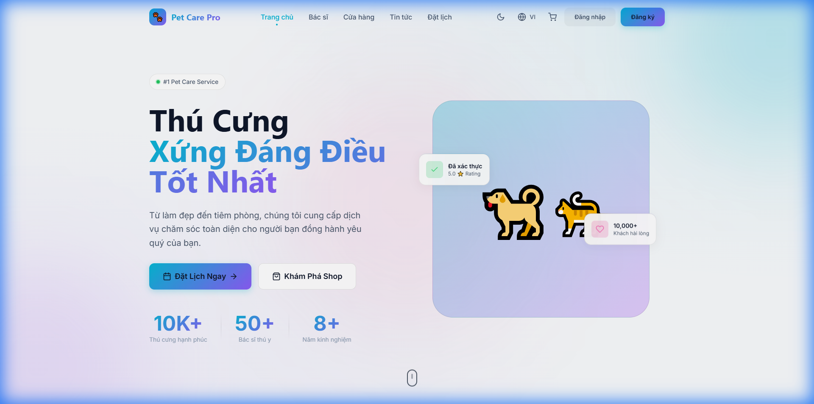
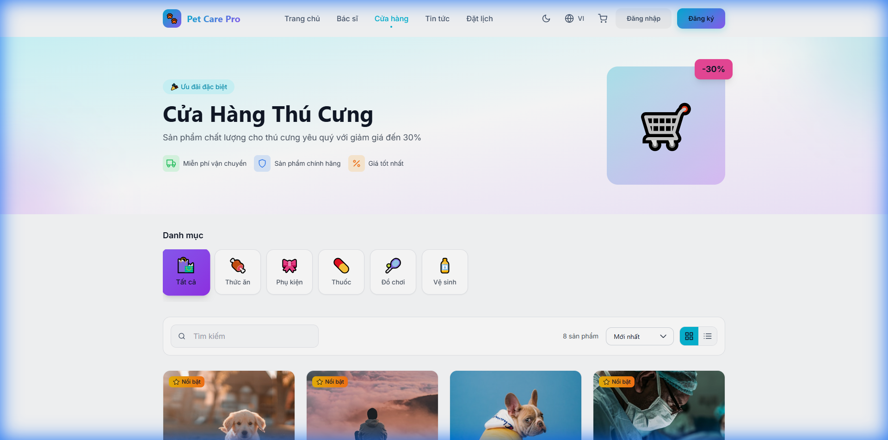
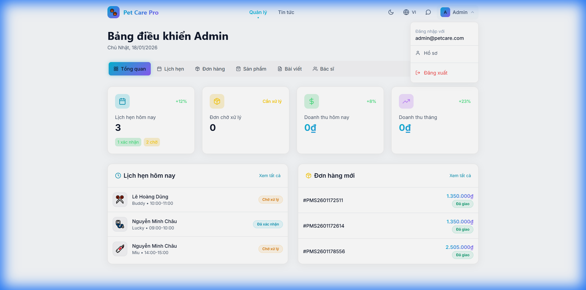

<div align="center">

# 🐾 Pet Care Pro


<br/>
<br/>

<p align="center">
  
</p>

<br/>

### 🌐 Language / Ngôn ngữ

<a href="#-english">
  
</a>
&nbsp;&nbsp;
<a href="#-tiếng-việt">
  
</a>

</div>

<br/>

---

<br/>

# 🇺🇸 English

<div align="center">

## 📖 Introduction

</div>

**Pet Care Pro** is a comprehensive full-stack web application designed for pet management, veterinary services, and e-commerce. Built with modern technologies, it provides a seamless experience for pet owners, veterinarians, and administrators.

<div align="center">

| 🐕 Pet Management | 📅 Appointments | 🛒 Online Shop | 💬 Live Chat |
|:---:|:---:|:---:|:---:|
| Track pets info & health | Book vet visits | Buy food & accessories | Chat with vets |

| 📰 News & Articles | 👨‍💼 Admin Dashboard | 🌙 Dark Mode | 🌐 Multi-language |
|:---:|:---:|:---:|:---:|
| Read & write pet tips | Manage everything | Eye-friendly UI | English & Vietnamese |

</div>

<br/>

---

<div align="center">

## 🛠️ Tech Stack

</div>

<div align="center">

### Frontend Technologies

<p>


</p>

### Backend Technologies

<p>


</p>

</div>

<br/>

---

<div align="center">

## ✨ Features

</div>

<table>
<tr>
<td width="50%">

### 🐕 Pet Management
- ✅ Add, edit, delete pet profiles
- ✅ Visual health timeline with charts
- ✅ Complete medical history tracking
- ✅ Vaccination reminder system
- ✅ Multiple pet species support

</td>
<td width="50%">

### 📅 Appointment Booking
- ✅ 4-step intuitive booking wizard
- ✅ Multiple services (Grooming, Vaccination, Checkup, Surgery, Boarding, Training)
- ✅ Real-time slot availability
- ✅ Staff/Doctor selection
- ✅ Appointment status tracking

</td>
</tr>
<tr>
<td width="50%">

### 🛒 Online Shop
- ✅ Product categories (Food, Accessories, Medicine, Toys, Hygiene)
- ✅ Advanced search & filtering
- ✅ Shopping cart with quantity control
- ✅ Order tracking with status timeline
- ✅ Product ratings & reviews

</td>
<td width="50%">

### 👨‍💼 Admin Dashboard
- ✅ Real-time statistics & analytics
- ✅ Appointment management by date
- ✅ Order processing & status updates
- ✅ Product inventory management
- ✅ Article review & approval
- ✅ Staff/Doctor management

</td>
</tr>
<tr>
<td width="50%">

### 💬 Live Chat
- ✅ Real-time messaging
- ✅ Conversation history
- ✅ Customer-Staff communication
- ✅ Message notifications

</td>
<td width="50%">

### 🎨 UI/UX Features
- ✅ Dark / Light mode toggle
- ✅ Fully responsive design
- ✅ Smooth animations
- ✅ Modern glassmorphism design
- ✅ Intuitive navigation

</td>
</tr>
</table>

<br/>

---

<div align="center">

## 🚀 Installation

</div>

### Prerequisites

> **Required software before installation:**

| Software | Version | Download |
|----------|---------|----------|
| Node.js | ≥ 18.0.0 | [nodejs.org](https://nodejs.org/) |
| MongoDB | ≥ 6.0 | [mongodb.com](https://www.mongodb.com/try/download/community) |
| Git | Latest | [git-scm.com](https://git-scm.com/) |

### Step 1️⃣ Clone Repository

```bash
git clone https://github.com/your-username/pet-management-system.git
cd pet-management-system
```

### Step 2️⃣ Setup Backend

```bash
# Navigate to backend folder
cd backend

# Install dependencies
npm install

# Create environment file
cp .env.example .env

# Edit .env with your settings:
# MONGO_URI=mongodb://localhost:27017/petcare
# JWT_SECRET=your_super_secret_key_here
# PORT=5000

# Seed demo data
node seed.js

# Start server (development)
npm run dev
```

> 🟢 Backend runs at: **http://localhost:5000**

### Step 3️⃣ Setup Frontend

```bash
# Navigate to frontend folder (from root)
cd frontend

# Install dependencies
npm install

# Start development server
npm run dev
```

> 🟢 Frontend runs at: **http://localhost:5173**

### 🎉 Demo Accounts

<div align="center">

| Role | Email | Password |
|:---:|:---:|:---:|
| 👑 **Admin** | `admin@petcare.com` | `admin123` |
| 👨‍⚕️ **Staff** | `staff@petcare.com` | `staff123` |
| 👤 **Customer** | `customer@example.com` | `customer123` |

</div>

<br/>

---

<div align="center">

## 📚 API Documentation

</div>

### 🔗 Base URL
```
http://localhost:5000/api
```

<details>
<summary><b>🔐 Authentication Endpoints</b></summary>

| Method | Endpoint | Description | Auth |
|:------:|----------|-------------|:----:|
| `POST` | `/auth/register` | Register new user | ❌ |
| `POST` | `/auth/login` | User login | ❌ |
| `GET` | `/auth/me` | Get current user profile | ✅ |
| `PUT` | `/auth/profile` | Update user profile | ✅ |
| `GET` | `/auth/staff` | Get all staff members | ✅ |
| `GET` | `/auth/doctors` | Get all doctors | ❌ |

</details>

<details>
<summary><b>🐾 Pet Endpoints</b></summary>

| Method | Endpoint | Description | Auth |
|:------:|----------|-------------|:----:|
| `GET` | `/pets` | Get user's pets | ✅ |
| `POST` | `/pets` | Add new pet | ✅ |
| `GET` | `/pets/:id` | Get pet details | ✅ |
| `PUT` | `/pets/:id` | Update pet | ✅ |
| `DELETE` | `/pets/:id` | Delete pet | ✅ |
| `POST` | `/pets/:id/medical` | Add medical record | ✅ |

</details>

<details>
<summary><b>📅 Appointment Endpoints</b></summary>

| Method | Endpoint | Description | Auth |
|:------:|----------|-------------|:----:|
| `GET` | `/appointments` | Get user appointments | ✅ |
| `POST` | `/appointments` | Create appointment | ✅ |
| `PUT` | `/appointments/:id` | Update appointment | ✅ |
| `DELETE` | `/appointments/:id` | Cancel appointment | ✅ |
| `GET` | `/appointments/available-slots` | Get available time slots | ✅ |
| `GET` | `/appointments/by-date` | Get appointments by date | 🔒 Staff |

</details>

<details>
<summary><b>🛒 Product Endpoints</b></summary>

| Method | Endpoint | Description | Auth |
|:------:|----------|-------------|:----:|
| `GET` | `/products` | List all products | ❌ |
| `GET` | `/products/:id` | Get product details | ❌ |
| `POST` | `/products` | Add new product | 🔒 Admin |
| `PUT` | `/products/:id` | Update product | 🔒 Admin |
| `DELETE` | `/products/:id` | Delete product | 🔒 Admin |

</details>

<details>
<summary><b>📦 Order Endpoints</b></summary>

| Method | Endpoint | Description | Auth |
|:------:|----------|-------------|:----:|
| `GET` | `/orders` | Get user orders | ✅ |
| `POST` | `/orders` | Create new order | ✅ |
| `GET` | `/orders/:id` | Get order details | ✅ |
| `PUT` | `/orders/:id/status` | Update order status | 🔒 Staff |
| `PUT` | `/orders/:id/cancel` | Cancel order | ✅ |

</details>

<details>
<summary><b>💬 Message Endpoints</b></summary>

| Method | Endpoint | Description | Auth |
|:------:|----------|-------------|:----:|
| `GET` | `/messages/conversations` | Get all conversations | ✅ |
| `GET` | `/messages/:userId` | Get messages with user | ✅ |
| `POST` | `/messages` | Send message | ✅ |

</details>

<details>
<summary><b>📰 News Endpoints</b></summary>

| Method | Endpoint | Description | Auth |
|:------:|----------|-------------|:----:|
| `GET` | `/news` | Get all articles | ❌ |
| `GET` | `/news/:id` | Get article details | ❌ |
| `POST` | `/news` | Create article | ✅ |
| `PUT` | `/news/:id/approve` | Approve/Reject article | 🔒 Staff |

</details>

<br/>

---

<div align="center">

## 📸 Demo Screenshots

</div>

<div align="center">

### 🏠 Homepage
*Modern landing page with service highlights*



---

### 🛒 Shop Page
*Product catalog with filtering and categories*



---

### 📰 News Page
*Pet care articles and tips*


---

### 👨‍💼 Admin Dashboard
*Complete management interface*



---

### 🎬 Demo Recording
*Watch the app in action*


</div>

<br/>

---

<div align="center">

## 📁 Project Structure

</div>

```
pet-management-system/
│
├── 📂 backend/                    # Node.js API Server
│   ├── 📂 config/                 # Database configuration
│   ├── 📂 controllers/            # Request handlers
│   ├── 📂 middleware/             # Auth & error middleware
│   ├── 📂 models/                 # Mongoose schemas
│   ├── 📂 routes/                 # API route definitions
│   ├── 📄 server.js               # Server entry point
│   └── 📄 seed.js                 # Demo data seeder
│
├── 📂 frontend/                   # React Application
│   ├── 📂 public/                 # Static assets
│   │   └── 📂 images/             # Local images
│   └── 📂 src/
│       ├── 📂 components/         # Reusable UI components
│       ├── 📂 context/            # React Context (Auth, Cart, Theme)
│       ├── 📂 i18n/               # Internationalization (EN/VI)
│       ├── 📂 pages/              # Page components
│       ├── 📂 services/           # API service layer
│       └── 📄 App.jsx             # Main application
│
├── 📄 README.md                   # This file
└── 📄 LICENSE                     # MIT License
```

<br/>

---

<br/>

# 🇻🇳 Tiếng Việt

<div align="center">

## 📖 Giới Thiệu

</div>

**Pet Care Pro** là ứng dụng web full-stack toàn diện được thiết kế cho việc quản lý thú cưng, dịch vụ thú y và thương mại điện tử. Được xây dựng với công nghệ hiện đại, mang đến trải nghiệm liền mạch cho chủ nuôi thú cưng, bác sĩ thú y và quản trị viên.

<div align="center">

| 🐕 Quản Lý Thú Cưng | 📅 Đặt Lịch Hẹn | 🛒 Cửa Hàng Online | 💬 Chat Trực Tiếp |
|:---:|:---:|:---:|:---:|
| Theo dõi thông tin & sức khỏe | Đặt lịch khám thú y | Mua thức ăn & phụ kiện | Chat với bác sĩ |

| 📰 Tin Tức & Bài Viết | 👨‍💼 Dashboard Quản Lý | 🌙 Chế Độ Tối | 🌐 Đa Ngôn Ngữ |
|:---:|:---:|:---:|:---:|
| Đọc & viết mẹo nuôi thú | Quản lý mọi thứ | Giao diện dễ nhìn | Tiếng Việt & English |

</div>

<br/>

---

<div align="center">

## 🛠️ Công Nghệ Sử Dụng

</div>

<div align="center">

### Công Nghệ Frontend

<p>


</p>

### Công Nghệ Backend

<p>


</p>

</div>

<br/>

---

<div align="center">

## ✨ Tính Năng

</div>

<table>
<tr>
<td width="50%">

### 🐕 Quản Lý Thú Cưng
- ✅ Thêm, sửa, xóa hồ sơ thú cưng
- ✅ Timeline sức khỏe với biểu đồ
- ✅ Theo dõi lịch sử khám bệnh đầy đủ
- ✅ Hệ thống nhắc nhở tiêm phòng
- ✅ Hỗ trợ nhiều loài thú cưng

</td>
<td width="50%">

### 📅 Đặt Lịch Hẹn
- ✅ Wizard đặt lịch 4 bước trực quan
- ✅ Nhiều dịch vụ (Làm đẹp, Tiêm phòng, Khám bệnh, Phẫu thuật, Trông giữ, Huấn luyện)
- ✅ Kiểm tra khung giờ trống thời gian thực
- ✅ Chọn Nhân viên/Bác sĩ
- ✅ Theo dõi trạng thái lịch hẹn

</td>
</tr>
<tr>
<td width="50%">

### 🛒 Cửa Hàng Online
- ✅ Danh mục sản phẩm (Thức ăn, Phụ kiện, Thuốc, Đồ chơi, Vệ sinh)
- ✅ Tìm kiếm & lọc nâng cao
- ✅ Giỏ hàng với điều chỉnh số lượng
- ✅ Theo dõi đơn hàng với timeline
- ✅ Đánh giá & nhận xét sản phẩm

</td>
<td width="50%">

### 👨‍💼 Dashboard Quản Trị
- ✅ Thống kê & phân tích thời gian thực
- ✅ Quản lý lịch hẹn theo ngày
- ✅ Xử lý đơn hàng & cập nhật trạng thái
- ✅ Quản lý kho sản phẩm
- ✅ Duyệt & phê duyệt bài viết
- ✅ Quản lý Nhân viên/Bác sĩ

</td>
</tr>
<tr>
<td width="50%">

### 💬 Chat Trực Tiếp
- ✅ Nhắn tin thời gian thực
- ✅ Lịch sử hội thoại
- ✅ Giao tiếp Khách hàng-Nhân viên
- ✅ Thông báo tin nhắn

</td>
<td width="50%">

### 🎨 Tính Năng UI/UX
- ✅ Chuyển đổi Chế độ Tối / Sáng
- ✅ Thiết kế responsive hoàn toàn
- ✅ Animations mượt mà
- ✅ Thiết kế glassmorphism hiện đại
- ✅ Điều hướng trực quan

</td>
</tr>
</table>

<br/>

---

<div align="center">

## 🚀 Cài Đặt

</div>

### Yêu Cầu Hệ Thống

> **Phần mềm cần thiết trước khi cài đặt:**

| Phần mềm | Phiên bản | Tải về |
|----------|-----------|--------|
| Node.js | ≥ 18.0.0 | [nodejs.org](https://nodejs.org/) |
| MongoDB | ≥ 6.0 | [mongodb.com](https://www.mongodb.com/try/download/community) |
| Git | Mới nhất | [git-scm.com](https://git-scm.com/) |

### Bước 1️⃣ Clone Repository

```bash
git clone https://github.com/your-username/pet-management-system.git
cd pet-management-system
```

### Bước 2️⃣ Cài Đặt Backend

```bash
# Di chuyển đến thư mục backend
cd backend

# Cài đặt dependencies
npm install

# Tạo file environment
cp .env.example .env

# Chỉnh sửa .env với cấu hình của bạn:
# MONGO_URI=mongodb://localhost:27017/petcare
# JWT_SECRET=khoa_bi_mat_cua_ban
# PORT=5000

# Seed dữ liệu demo
node seed.js

# Khởi động server (development)
npm run dev
```

> 🟢 Backend chạy tại: **http://localhost:5000**

### Bước 3️⃣ Cài Đặt Frontend

```bash
# Di chuyển đến thư mục frontend (từ thư mục gốc)
cd frontend

# Cài đặt dependencies
npm install

# Khởi động development server
npm run dev
```

> 🟢 Frontend chạy tại: **http://localhost:5173**

### 🎉 Tài Khoản Demo

<div align="center">

| Vai Trò | Email | Mật khẩu |
|:---:|:---:|:---:|
| 👑 **Admin** | `admin@petcare.com` | `admin123` |
| 👨‍⚕️ **Nhân viên** | `staff@petcare.com` | `staff123` |
| 👤 **Khách hàng** | `customer@example.com` | `customer123` |

</div>

<br/>

---

<div align="center">

## 📚 Tài Liệu API

</div>

### 🔗 Base URL
```
http://localhost:5000/api
```

<details>
<summary><b>🔐 Authentication Endpoints</b></summary>

| Phương thức | Endpoint | Mô tả | Xác thực |
|:------:|----------|-------|:----:|
| `POST` | `/auth/register` | Đăng ký người dùng mới | ❌ |
| `POST` | `/auth/login` | Đăng nhập | ❌ |
| `GET` | `/auth/me` | Lấy thông tin người dùng hiện tại | ✅ |
| `PUT` | `/auth/profile` | Cập nhật hồ sơ | ✅ |
| `GET` | `/auth/staff` | Lấy danh sách nhân viên | ✅ |
| `GET` | `/auth/doctors` | Lấy danh sách bác sĩ | ❌ |

</details>

<details>
<summary><b>🐾 Pet Endpoints</b></summary>

| Phương thức | Endpoint | Mô tả | Xác thực |
|:------:|----------|-------|:----:|
| `GET` | `/pets` | Lấy danh sách thú cưng | ✅ |
| `POST` | `/pets` | Thêm thú cưng mới | ✅ |
| `GET` | `/pets/:id` | Chi tiết thú cưng | ✅ |
| `PUT` | `/pets/:id` | Cập nhật thú cưng | ✅ |
| `DELETE` | `/pets/:id` | Xóa thú cưng | ✅ |
| `POST` | `/pets/:id/medical` | Thêm hồ sơ y tế | ✅ |

</details>

<details>
<summary><b>📅 Appointment Endpoints</b></summary>

| Phương thức | Endpoint | Mô tả | Xác thực |
|:------:|----------|-------|:----:|
| `GET` | `/appointments` | Lấy lịch hẹn của user | ✅ |
| `POST` | `/appointments` | Tạo lịch hẹn | ✅ |
| `PUT` | `/appointments/:id` | Cập nhật lịch hẹn | ✅ |
| `DELETE` | `/appointments/:id` | Hủy lịch hẹn | ✅ |
| `GET` | `/appointments/available-slots` | Lấy khung giờ trống | ✅ |
| `GET` | `/appointments/by-date` | Lấy lịch hẹn theo ngày | 🔒 Staff |

</details>

<details>
<summary><b>🛒 Product Endpoints</b></summary>

| Phương thức | Endpoint | Mô tả | Xác thực |
|:------:|----------|-------|:----:|
| `GET` | `/products` | Danh sách sản phẩm | ❌ |
| `GET` | `/products/:id` | Chi tiết sản phẩm | ❌ |
| `POST` | `/products` | Thêm sản phẩm mới | 🔒 Admin |
| `PUT` | `/products/:id` | Cập nhật sản phẩm | 🔒 Admin |
| `DELETE` | `/products/:id` | Xóa sản phẩm | 🔒 Admin |

</details>

<details>
<summary><b>📦 Order Endpoints</b></summary>

| Phương thức | Endpoint | Mô tả | Xác thực |
|:------:|----------|-------|:----:|
| `GET` | `/orders` | Lấy đơn hàng của user | ✅ |
| `POST` | `/orders` | Tạo đơn hàng mới | ✅ |
| `GET` | `/orders/:id` | Chi tiết đơn hàng | ✅ |
| `PUT` | `/orders/:id/status` | Cập nhật trạng thái | 🔒 Staff |
| `PUT` | `/orders/:id/cancel` | Hủy đơn hàng | ✅ |

</details>

<details>
<summary><b>💬 Message Endpoints</b></summary>

| Phương thức | Endpoint | Mô tả | Xác thực |
|:------:|----------|-------|:----:|
| `GET` | `/messages/conversations` | Lấy tất cả hội thoại | ✅ |
| `GET` | `/messages/:userId` | Lấy tin nhắn với user | ✅ |
| `POST` | `/messages` | Gửi tin nhắn | ✅ |

</details>

<details>
<summary><b>📰 News Endpoints</b></summary>

| Phương thức | Endpoint | Mô tả | Xác thực |
|:------:|----------|-------|:----:|
| `GET` | `/news` | Lấy tất cả bài viết | ❌ |
| `GET` | `/news/:id` | Chi tiết bài viết | ❌ |
| `POST` | `/news` | Tạo bài viết | ✅ |
| `PUT` | `/news/:id/approve` | Duyệt/Từ chối bài viết | 🔒 Staff |

</details>

<br/>

---

<div align="center">

## 📸 Demo Screenshots

</div>

<div align="center">

### 🏠 Trang Chủ
*Trang landing hiện đại với các dịch vụ nổi bật*


---

### 🛒 Trang Cửa Hàng
*Danh mục sản phẩm với bộ lọc và phân loại*


---

### 📰 Trang Tin Tức
*Bài viết và mẹo chăm sóc thú cưng*


---

### 👨‍💼 Dashboard Quản Trị
*Giao diện quản lý toàn diện*


---

### 🎬 Video Demo
*Xem ứng dụng hoạt động*


</div>

<br/>

---

<div align="center">

## 📁 Cấu Trúc Dự Án

</div>

```
pet-management-system/
│
├── 📂 backend/                    # Node.js API Server
│   ├── 📂 config/                 # Cấu hình database
│   ├── 📂 controllers/            # Xử lý request
│   ├── 📂 middleware/             # Auth & error middleware
│   ├── 📂 models/                 # Mongoose schemas
│   ├── 📂 routes/                 # Định nghĩa API routes
│   ├── 📄 server.js               # Entry point server
│   └── 📄 seed.js                 # Seeder dữ liệu demo
│
├── 📂 frontend/                   # React Application
│   ├── 📂 public/                 # Static assets
│   │   └── 📂 images/             # Ảnh local
│   └── 📂 src/
│       ├── 📂 components/         # UI components tái sử dụng
│       ├── 📂 context/            # React Context (Auth, Cart, Theme)
│       ├── 📂 i18n/               # Đa ngôn ngữ (EN/VI)
│       ├── 📂 pages/              # Page components
│       ├── 📂 services/           # API service layer
│       └── 📄 App.jsx             # Main application
│
├── 📄 README.md                   # File này
└── 📄 LICENSE                     # MIT License
```

<br/>

---

<div align="center">

## 📝 License


This project is licensed under the MIT License - see the [LICENSE](LICENSE) file for details.

Dự án này được cấp phép theo Giấy phép MIT - xem file [LICENSE](LICENSE) để biết chi tiết.

<br/>

---

<br/>

### 🤝 Contributing | Đóng góp

Contributions are welcome! Please feel free to submit a Pull Request.

Chúng tôi hoan nghênh mọi đóng góp! Vui lòng tạo Pull Request.

<br/>

---

<br/>


<br/>

**⭐ Star this repo if you find it helpful! | Hãy star repo này nếu bạn thấy hữu ích!**

<br/>

[⬆ Back to Top | Về đầu trang](#-pet-care-pro)

</div>
